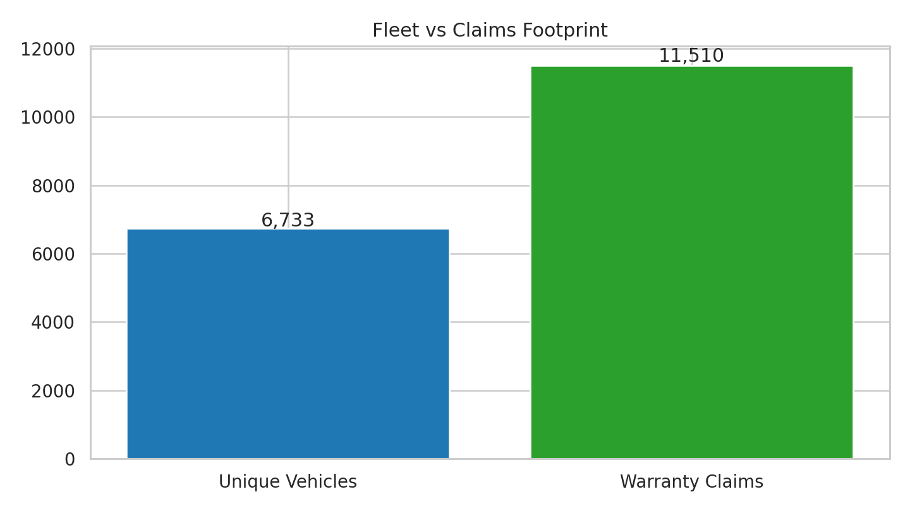
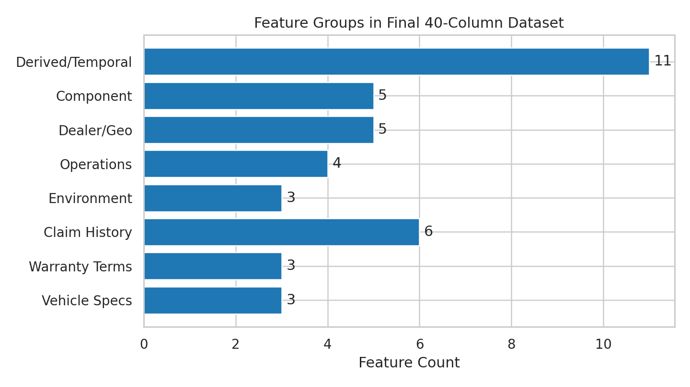
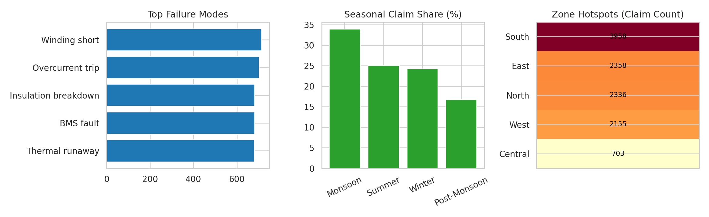
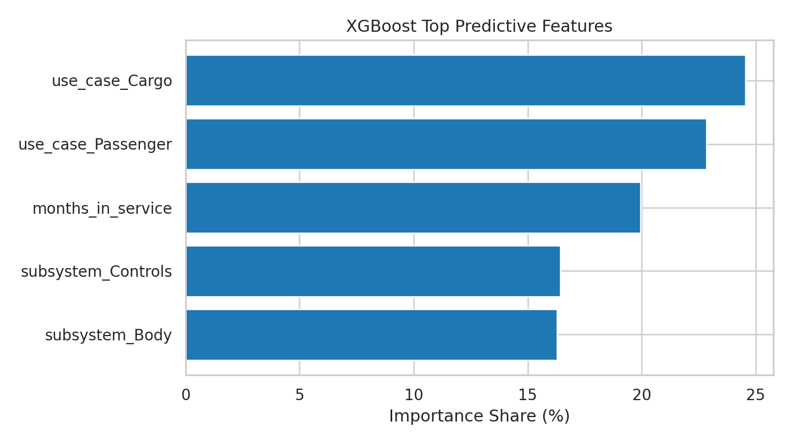
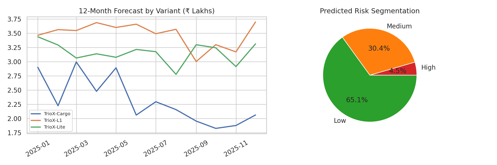
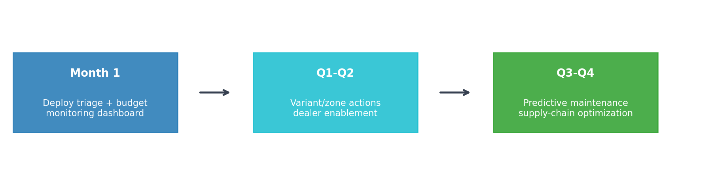

# Warranty Prediction System - Montra Electric

## Slide 1: Introduction to the Problem
- **Business challenge:** Identify vehicles likely to file a warranty claim in the next 3 months and forecast warranty costs for next 12 months by model variant.
- **Why it matters:** proactive risk mitigation, tighter cost control, better parts/service planning.
- **Dataset context:** clean merged table from warranty claims, vehicles, components, and dealers.
- **Scale:** **11,510** claim records, **6,733** vehicles, **40** features.
- **Key baseline indicators:** repeat claim rate **3.0%**, average claims/vehicle **1.71**, outliers **6.0%**.
- **Stakeholders:** Operations, Finance, Service Centers, Inventory teams.

## Slide 2: Understanding the Data: From Raw to Analysis-Ready
- Integrated sources: vehicle specs, warranty terms, claim history, environment, operational metrics, dealer capacity.
- Data preparation: schema harmonization, missing-value treatment, duplicate checks, date consistency validation.
- Feature engineering: temporal attributes, usage-intensity cues, cost-efficiency metrics, repeat-claim flags.
- Final analysis dataset: **40 features × 11,510 rows**.
- Data quality snapshot: completeness high; anomalous-cost records flagged (**6.0%**).

## Slide 3: Data Exploration Reveals Critical Patterns
- **Risk concentration:** highest claim intensity by variant: TrioX-Cargo (1.92 claims/vehicle), TrioX-Lite (1.88 claims/vehicle), TrioX-L2 (1.60 claims/vehicle).
- **Failure concentration:** major subsystem pressure in **Powertrain** (4,774 claims).
- **Seasonality:** **Monsoon** has highest claim share (34.0%).
- **Geographic hotspots:** top zone by volume = **South** (3,958 claims).
- **Quality indicators:** repeat claims **3.0%**, average claims/vehicle **1.71**, cost variability high.

## Slide 4: Technical Solution Design
- **Problem 1 (Classification):** XGBoost classifier for 3-month claim risk scoring.
- **Why XGBoost:** captures non-linear failure behavior, robust on mixed features, provides business-readable feature importance.
- **Key predictors (prototype Top 5):** use_case_Cargo (24.5%), use_case_Passenger (22.8%), months_in_service (19.9%), subsystem_Controls (16.4%), subsystem_Body (16.3%).
- *Note:* Percentages above are normalized within the Top 5 features only (not across all model features).
- **Problem 2 (Forecasting):** Prophet + ARIMA ensemble for monthly warranty cost by model variant.
- **Validation metrics:** classification (Precision/Recall/F1/ROC-AUC), forecasting (RMSE/MAE/MAPE), with confidence bands.

## Slide 5: Actionable Solutions & Key Results (Prototype Baseline)
- **Claim prediction (XGBoost baseline):** train acc **90.7%**, test acc **77.8%**, precision **17.7%**, recall **33.3%**, ROC-AUC **0.58**.
- **Risk segmentation:** high **4.5%**, medium **30.4%**, low **65.1%**.
- **Cost forecast accuracy (Prophet+ARIMA, backtest avg):** RMSE **₹189,454**, MAE **₹175,817**, MAPE **88.9%**.
- **12-month projected warranty cost (top variants):** TrioX-L1: ₹41.7L, TrioX-Lite: ₹37.9L, TrioX-Cargo: ₹27.7L.
- **Total 12-month projected cost:** **₹107.4 lakhs**; peak month **2025-01-01** (₹9.8L), low month **2025-11-01** (₹8.0L).

## Slide 6: Strategic Recommendations & Implementation Roadmap
- **Immediate (Month 1):** deploy triage for high-risk vehicles, integrate forecast into budgeting, launch monitoring dashboard.
- **Short-term (Q1-Q2):** root-cause deep dives for high-risk variants, zone-based service allocation, dealer training uplift.
- **Medium-term (Q3-Q4):** predictive maintenance rollout, component pre-positioning, periodic retraining/refinement.
- **KPI targets:** claim-prediction precision uplift, forecast MAPE reduction, warranty-cost reduction, prevention rate, service score improvement.
- **Expected outcome:** proactive interventions and more stable budget planning with measurable cost-control gains.

